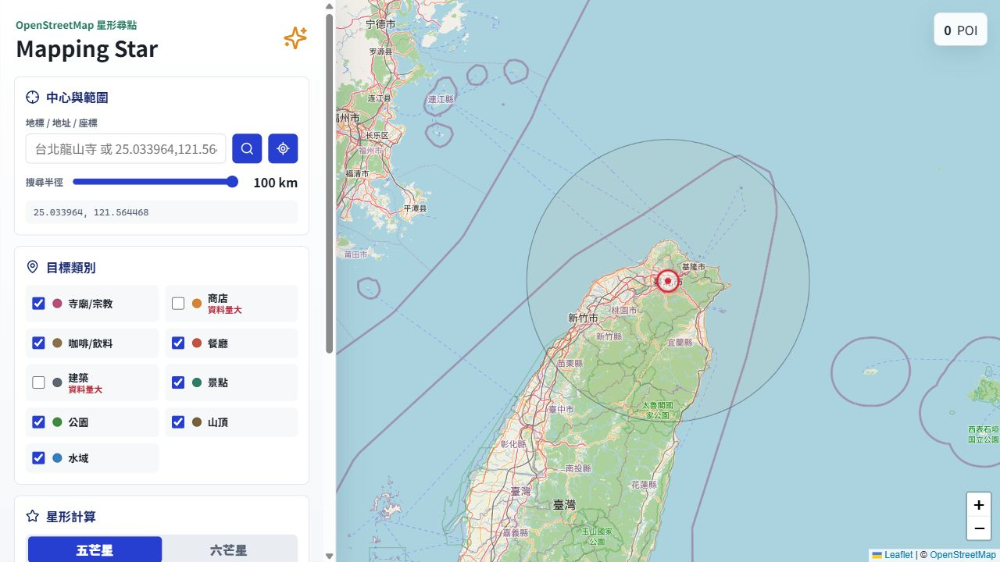

# Mapping Star

Mapping Star 是一個以地圖為核心的星形 POI 探索工具。使用者可以指定中心點與搜尋半徑，從 OpenStreetMap / Overpass API 取得周邊地標，再由演算法尋找可構成五芒星或六芒星的地點組合，並在 Leaflet 地圖上視覺化結果。



## 核心功能特性

- 互動式地圖介面：使用 Leaflet 呈現 OpenStreetMap、OpenTopoMap 與 Esri 衛星底圖。
- 地點搜尋：支援地標、地址與 `lat,lng` 座標輸入，並可使用瀏覽器定位。
- POI 類別篩選：以餐飲、商業、公共機構、人文觀光與自然為大類，子分類包含餐廳、速食連鎖、咖啡茶飲、夜生活、便利店、賣場、商辦、旅館複合、公共建築、大眾運輸、醫療、學校、宗教、景點展館、古蹟、公園、山峰、水體與水道。
- 半徑環帶搜尋：可設定內半徑與外半徑，聚焦特定距離範圍內的候選地點。
- 星形解算：支援五芒星與六芒星模式，可調整角度容差、候選點數量與旋轉步進。
- 視覺化輔助：顯示分區扇形、候選 POI、星形連線與結果評分。
- 魔法陣動畫：提供 16 種元素風格的星形動畫，支援播放、暫停、重播與速度調整。
- 收藏與復原：可收藏單一 POI 或星形結果，資料保存在瀏覽器 `localStorage`。
- 匯出資料：支援將選取結果或收藏項目匯出為 GPX / KML。
- 自動化品質檢查：使用 Vitest 覆蓋星形解算、地理計算、Overpass 查詢、設定儲存、匯出與魔法陣生成邏輯。

## 系統需求與安裝步驟

### 系統需求

- Node.js 20 LTS 或更新版本
- npm
- 可連線至下列公開服務的瀏覽器環境：
  - OpenStreetMap / OpenTopoMap / Esri 圖磚服務
  - Nominatim 地點搜尋服務
  - Overpass API

本專案不需要額外設定 API Key，但即時 POI 查詢會受到公開服務的流量限制與可用性影響。

### 安裝

```bash
git clone https://github.com/changweilin/mapping_star.git
cd mapping_star
npm ci
```

## 快速上手與使用範例

### 啟動開發伺服器

```bash
npm run dev
```

開啟瀏覽器並前往：

```text
http://localhost:5187/
```

### 基本操作流程

1. 在搜尋欄輸入地標、地址或座標，例如：

   ```text
   25.033964,121.564468
   ```

2. 調整內半徑與外半徑，預設搜尋範圍為 `0` 到 `30` 公里。
3. 選擇要納入計算的 POI 類別。
4. 選擇五芒星或六芒星模式。
5. 視需要調整角度容差、候選點數量與旋轉步進。
6. 點擊搜尋與解算按鈕，等待 Overpass API 回傳候選地點並產生星形結果。
7. 在結果清單中切換不同組合，或將結果收藏、匯出為 GPX / KML。

### 常用指令

```bash
# 執行單元測試
npm run test

# 型別檢查並建立正式版
npm run build

# 建立 GitHub Pages 版本，base path 會設為 /mapping_star/
npm run build:pages

# 預覽正式版輸出
npm run preview
```

## 專案架構說明

```text
mapping_star/
├── .github/
│   └── workflows/
│       └── deploy.yml        # GitHub Pages 自動部署流程
├── examples/
│   └── five-point-star.md    # 星形解算範例與測試資料說明
├── public/
│   ├── favicon.ico
│   ├── favicon.png
│   ├── icon-192.png
│   ├── apple-touch-icon.png
│   └── logo.png              # 靜態圖示資源
├── src/
│   ├── App.tsx               # 主要應用程式、地圖互動與 UI 狀態
│   ├── main.tsx              # React 入口
│   ├── styles.css            # 全站樣式與地圖/動畫視覺效果
│   ├── types.ts              # 共用型別定義
│   ├── data/
│   │   └── categories.ts     # POI 類別、Overpass 篩選條件與分類邏輯
│   ├── lib/
│   │   ├── exporters.ts      # GPX / KML 匯出
│   │   ├── favorites.ts      # 收藏資料的 localStorage 存取
│   │   ├── geo.ts            # 距離、方位角與座標推算
│   │   ├── lastStar.ts       # 最近一次星形結果快取
│   │   ├── magicCircle.ts    # 魔法陣筆畫、符號與動畫資料
│   │   ├── overpass.ts       # Overpass 查詢、容錯與 POI 解析
│   │   ├── placeSearch.ts    # 座標解析與 Nominatim 地點搜尋
│   │   ├── settings.ts       # 使用者設定正規化與保存
│   │   └── solver.ts         # 五芒星/六芒星解算核心
│   └── test/
│       └── *.test.ts         # Vitest 單元測試
├── index.html                # Vite HTML 入口
├── package.json              # npm scripts 與相依套件
├── tsconfig.json             # TypeScript 設定
└── vite.config.ts            # Vite / Vitest 設定
```

### 技術棧

- React 18
- TypeScript
- Vite
- Leaflet
- lucide-react
- Vitest

## 授權條款

本專案採用 GNU General Public License v3.0（GPLv3）授權。

你可以使用、研究、修改與散布本程式；若散布修改後的版本，需同樣以 GPLv3 授權並提供對應原始碼。本軟體不附帶任何明示或默示擔保，完整條款請以 GPLv3 正式授權文字為準。
